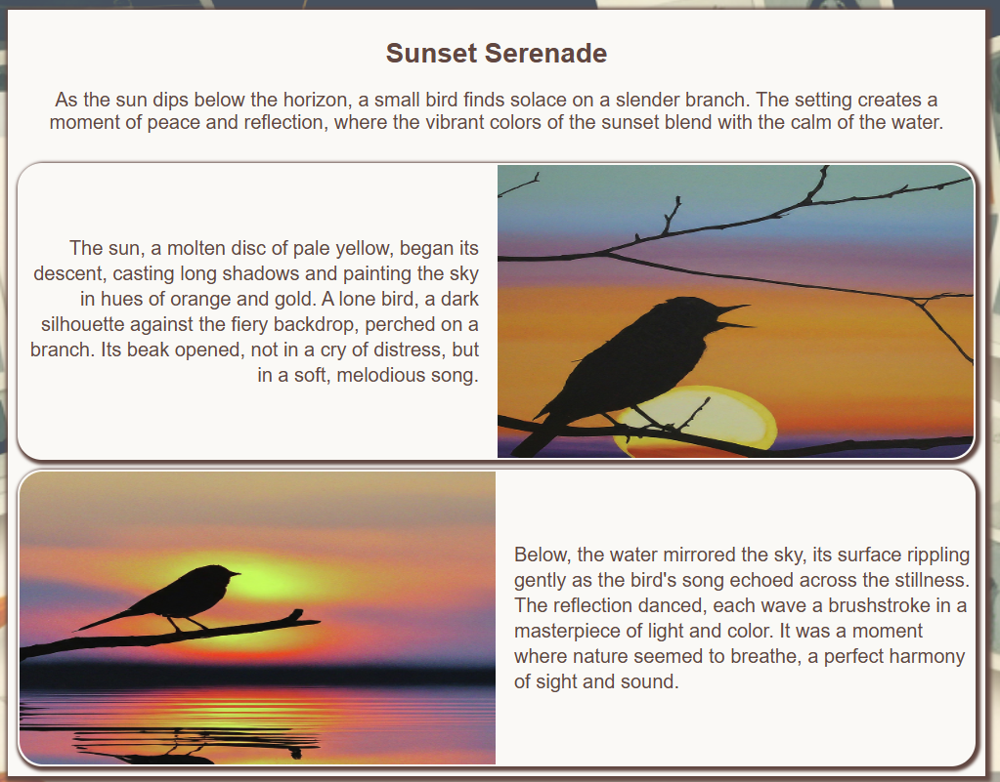

# Story Generator Web Application

This Flask-based web application allows users to generate stories based on either a text context or an uploaded image. It leverages Google's Generative AI models (both Language and Vision) to create engaging narratives and visuals.

# Generated Story Samples





## Project Structure

The project is organized as follows:

```
├── app.py                      # Main Flask application logic
├── requirements.txt            # Project dependencies
├── templates                   # HTML templates for web pages
│   ├── index.html               # Base template for all pages
│   ├── context.html            # Form for context input
│   ├── image.html              # Displays uploaded images
│   ├── home.html              # Home page
│   ├── story.html              # Displays the generated story
│   └── story_to_print.html     # Displays the story for print
├── static                      # Static assets 
│   └── images                  # Directory for uploaded images
|   |__ css                     # css style file
└── src                         # Source code for story generation
    ├── story_builder.py        # Main logic for story creation
    ├── gen_story.py            # Generates text components of the story
    ├── story_image.py          # Generates images from text prompts
    ├── theme_generator.py      # Generates themes for stories
    └── format_story.py         # Formats the story into HTML
```

## How to Run the Application

1.  **Clone the repository:**

    ```bash
    git clone <repository-url>
    cd <project-directory>
    ```

2.  **Create a virtual environment:**

    ```bash
    python -m venv venv
    source venv/bin/activate  # On Windows: venv\Scripts\activate
    ```

3.  **Install dependencies:**

    ```bash
    pip install -r requirements.txt
    ```
4.  **Set up Google Cloud Credentials:**

    *   Ensure you have a Google Cloud project and have enabled the Generative AI API.
    *   Set up authentication as described in the [Google Cloud documentation](https://cloud.google.com/docs/authentication/getting-started)
    *   Set the `GOOGLE_APPLICATION_CREDENTIALS` environment variable.
        ```
        export GOOGLE_APPLICATION_CREDENTIALS="YOUR_API_KEY"
        ```
    * Set the `GOOGLE_PROJECT_ID` environment variable.
        ```
        export GOOGLE_PROJECT_ID="YOUR_PROJECT_ID"
        ```
    * Set the `LANGUAGE_MODEL` environment variable.
        ```
        export LANGUAGE_MODEL="Language model to be used in the application"

    * Set the `VISION_MODEL` environment variable.
        ```
        export VISION_MODEL="Vision model to be used in the application"

    * Set the `IMAGE_TO_TEXT_MODEL` environment variable.
        ```
        export IMAGE_TO_TEXT_MODEL="To generate context from image"

    * Refer to setup-local.sh # for seting up environment variables and authenticaiton

5.  **Run the Flask application:**

    ```bash
    python app.py
    ```

6.  **Open your browser and go to:**
    `http://127.0.0.1:5000/`

## Functionality

The application supports the following:

-   **Home Page:** Presents a landing page with options to generate stories from context or images.
-   **Image Upload:** Upload an image that will serve as the basis of a story. The uploaded image will be displayed on page for user confirmation.
-   **Context Input:** Input text to be used as a base for story.
-   **Story Generation:**
    -   Generates a story with an appropriate theme and visual style based on text input, or from image.
    -   Displays the generated story as a webpage using `story.html`.
    -   Provides a printable version of the story in `story_to_print.html`.

## Technologies Used

-   **Python:** Main programming language.
-   **Flask:** Web framework.
-   **Google Generative AI:** Language and Vision models.
-   **Langchain:** Library to interact with language models.
-   **HTML/CSS:** For web page rendering.

## App deployment to the Cloud Run

# Deploying a Flask Application on Google Cloud Run with Vertex AI and Secret Manager

This document outlines the steps to deploy a Flask application to Google Cloud Run, leveraging Google Cloud's Vertex AI for AI/ML capabilities and Secret Manager for secure credential storage. The deployment process is automated using a provided shell script setup.sh

## Prerequisites

Before you begin, make sure you have the following:

1. **Google Cloud Platform Account:** You need an active GCP account with a project created.
2. **Google Cloud SDK (gcloud):** Install and configure the gcloud CLI tool on your local machine. Refer to the [Google Cloud SDK Installation Guide](https://cloud.google.com/sdk/docs/install)
3. **Docker:** Install Docker on your local machine. Refer to the [Docker Installation Guide](https://docs.docker.com/get-docker/)
4. **Flask Application:** Your Flask application should be Dockerized with a `Dockerfile` in the root directory.
5. **Service Account Key Path:** You need to decide and keep the local path for service account key file. This path will be used to read and create the service account key file (Example : `/c/mydata/projects/keys/story-teller.json` ). 
6. **`.env.yaml` file:** Create the `.env.yaml` file to define environment variable for application like `LANGUAGE_MODEL`,`VISION_MODEL` ,`IMAGE_TO_TEXT_MODEL` etc. This will be used to set the environment varible while deploying application on Google Cloud Run
   ```yaml
   LANGUAGE_MODEL: "gemini-2.0-flash-exp"
   VISION_MODEL: "imagegeneration@006"
   IMAGE_TO_TEXT_MODEL: "gemini-1.5-pro"
   GOOGLE_APPLICATION_CREDENTIALS: "/secrets/gemini-credentials.json"
   ```
   
## Deployment Steps

Follow these steps to deploy your application:

**Step 1: Configure Environment Variables**

Before executing setup.sh, ensure you have set correct values for below variables. You can set these variables in your terminal or directly in the script file.

*   **`PROJECT_ID`**: Your Google Cloud Project ID (e.g., `my-gcp-project`).
*   **`REGION`**: Google Cloud Region to deploy to (e.g., `us-central1`).
*   **`SVC_ACCOUNT`**: Service account name for your application (e.g., `my-app-service-account`).
*   **`REPO`**: Artifact Registry repository name (e.g., `my-docker-repo`).
*   **`SECRET_ID`**: Secret Manager secret ID for your credentials (e.g., `my-app-secret`).
*   **`APP_NAME`**: Name of your Cloud Run application (e.g., `my-flask-app`).
*   **`APP_VERSION`**: Version of your application (e.g., `0.1`).
*   **`CREDENTIALS_FILE`**: Path of the credentials file within the container. Should be `/secrets/gemini-credentials.json`.
*   **`LANGUAGE_MODEL`**: Language model to be used in the application
*   **`VISION_MODEL`**: Vision model to be used in the application
*   **`IMAGE_TO_TEXT_MODEL`**: Image to text model to be used in the application
*   **`LOCAL_CREDENTIALS_FILE`**: Absolute local path to save service account json file (e.g., `/c/mydata/projects/keys/story-teller.json`). This needs to be changed according to your local file system.

You can set these variables in your terminal using:
   ```bash
   export PROJECT_ID="your-project-id"
   export REGION="us-central1"
   # and so on for other variables
   ```

   or you can change these directly in the setup.sh file.

**Step 2:  Run the setup.sh`**

Open your terminal, navigate to the root directory of your project (where your setup.sh is located), and run the script with execute permission:

```bash
chmod +x setup.sh
./setup.sh
```
**Note:** The script saves the service account's JSON credential file to a local path, specified by variable `LOCAL_CREDENTIALS_FILE`. This path will be used to create and save service account key file. Please make sure that the path exist and is accessible.

**Step 3: Understanding the setup.sh**

The script performs the following actions:

1.  **Environment Setup:** Sets environment variables and the Google Cloud project configuration.
2.  **Service Account Creation:** Creates a service account and grants it the `aiplatform.user` role to access Vertex AI resources.
3.  **Artifact Registry Setup:** Creates an Artifact Registry repository and configures Docker authentication for it.
4.  **Docker Image Build and Push:** Builds the Docker image and pushes it to the Artifact Registry.
5.  **Secret Manager Setup:** Creates a Secret Manager secret and stores the service account's JSON credentials, then grants the service account access.
6.  **Cloud Run Deployment:** Deploys the application to Cloud Run, using the service account, and setting up the secret environment variable, specifying resource constraints such as max instances, memory, timeout, and other settings from environment variable file (.env.yaml).

**Step 4: Review the output**

If everything was configured correctly, the output should finish with message:

```
Deployment complete for <APP_NAME> version <APP_VERSION>
```

and Cloud Run service will be deployed to the specified region.

**Step 5:  Access your Application**

Once the deployment completes, Cloud Run will output a URL. Use this URL to access your deployed Flask application.

## Troubleshooting

*   **Permissions:** Ensure that your Google Cloud account has sufficient permissions to perform these actions.
*   **gcloud CLI:** Make sure that `gcloud` command is configured and the current project is selected.
*   **Docker:** Verify that Docker is installed and running, and that your Flask application can be Dockerized successfully.
*   **Artifact Registry:** Confirm that the docker image is successfully built and pushed.
*   **Secret Manager:**  Verify that the secret is created and service account has the role `secretmanager.secretAccessor`.
*   **Cloud Run:** Check the Cloud Run logs for any deployment errors.

## Security Considerations

*   **Service Account Key:** Ensure that the service account key file is stored securely and not committed to source control.
*   **Secret Manager:** Use Secret Manager to manage sensitive credentials instead of storing them directly in your code or environment variables.

